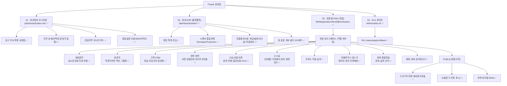

# 분양앱 개발기획안 — 통합 사이트맵 & 스토리보드

> 현재 구현현황(코드 실측)과 추가 구현계획(성장루프 backlog + Top7 혁신)을 하나로 통합한 기획 정본.
> 범례: ✅ 구현·라이브 · 🔶 부분구현/배포대기(deploy-pending) · ⬜ 미착수 계획

## 0. 제품 구조 요약 — "4개 표면, 1개 데이터원장"

분양앱은 단일 앱이 아니라 **한 데이터 백본(v62 ERP·66모델·해시체인 원장·RLS 격리) 위의 4개 표면**이다.

| # | 표면 | 라우트 | 주 사용자 | 성격 |
|---|------|--------|----------|------|
| S1 | **분양정보 모니터링** | `(dashboard)/sales-info` | 사업검토자(플랫폼 일반) | 청약홈 공고 열람·관심지역 알림 |
| S2 | **분양 ERP 워크스페이스(플랫폼측)** | `(dashboard)/sales/*` | 시행사·관리자 | 통합관제·연결결산·현장 셋업 |
| S3 | **현장앱(독립 PWA)** | `(fieldapp)/sales/sites/[id]/workspace` | 대행사~영업직원·MH데스크 | 현장 영업 실무 전용 셸 |
| S4 | **RLS 관리자** | `/api/v1/admin/sales-rls` | 슈퍼관리자 | 테넌트 격리 부트스트랩 |

- **회원 5단계 + 슈퍼관리자**: 시행(DEVELOPER) · 대행(AGENCY/SUBAGENCY) · 본부장(GM_DIRECTOR/DIRECTOR) · 팀장(TEAM_LEADER) · 직원(MEMBER) · SUPERADMIN.
- **격리 모델**: 현장(site) 단위 RLS FORCE + X-Site-Token(8h, 매요청 DB 재검증) + ltree 조직경로(`path <@ org_path`)로 상위→하위 가시성. PUBLIC 영역(구인구직·소셜)은 현장격리 예외.
- **성장루프 성숙도(2026-06-19)**: 10개 서브시스템 평균 6.81 → **7.9** (critical/high 0). 9.5 게이트 미달분은 전부 라이브검증(배포후) 또는 MEDIUM backlog.

---

## 1. 사이트맵 (라우트·기능 계층)



### 라우트 상세 (프론트)

| 라우트 | 목적 | 주요 컴포넌트 | 상태 |
|--------|------|--------------|:--:|
| `(dashboard)/sales-info` | 분양정보 열람·관심지역 알림 | `presale/ProjectPresaleMap` | ✅ |
| `(dashboard)/sales` | 현장 목록(엔트리) | `sales/SalesSiteList` | ✅ |
| `(dashboard)/sales/sites` | 내 현장 리스트 | `sales-app/SiteListClient` | ✅ |
| `(dashboard)/sales/projection` | 시행사 통합관제 | `sales/DeveloperProjection` | ✅ |
| `(dashboard)/sales/[siteId]` | 현장 워크스페이스(플랫폼) | `sales/SalesSiteWorkspace` | ✅ |
| `(fieldapp)/sales/sites/[siteId]/workspace` | 현장앱 셸(독립 PWA) | `sales-app/SiteWorkspaceClient` | ✅ |

---

## 2. 기능 인벤토리 매트릭스 (구현현황 × 성장루프 점수)

| # | 서브시스템 | 점수 | 백엔드 엔드포인트(대표) | 프론트 | 상태 |
|---|-----------|:--:|------------------------|--------|:--:|
| C1 | 세대 라이프사이클·추첨 | 8.4 | `/units/{id}/hold·release·reserve·action·events·verify-chain`, `/draw/*` | UnitLiveBoard·UnitGrid·Grid3D·DrawMode·Unit360Panel | ✅ |
| C2 | 적정분양가·역산·원가 | 8.3 | `/pricing/suggest·revenue·solve-base·group-apply`, `/units/{id}/price` | FairPriceSuggestCard·PriceGroupingPanel·PricingConfigPanel | ✅ |
| C3 | 고객 CRM·업무일지 | 8.0 | `/my-customers`, `/customers/{id}/history·message`, `/work-logs` | CrmPanel·CustomerCardDrawer·WorkLogPanel | ✅ |
| C4 | 계약·청약·광고 | 8.0 | `/contracts/*`, `/subscription/*`, `/ad/roi` | SubscriptionPanel·계약 흐름 | ✅ |
| C5 | 수납·대출·보증 | 7.0 | `/payments/*`, `/loan/disburse·repay`, `/guarantee/check` | PaymentsPanel·LoanPanel | 🔶 |
| C6 | 수수료·더치페이·원천징수 | 8.0 | `/commission/agreements·splits·holdback·payouts`, `/tax/withholding` | CommissionBoard·CommissionDutchPay | ✅ |
| C7 | 조직도·직원·급여 | 8.0 | `/org/nodes·assign·team-overview`, `/staff/wage`, `/payroll` | OrgTree·StaffOverviewPanel | ✅ |
| C8 | 모델하우스 데스크 | 7.5 | `/mh/visitors/checkin·match·notify`, `/mh/stats·attendance` | (데스크 전용 화면) | ✅ |
| C9 | 회계·통합콘솔 | 7.5 | `/accounting/entry·summary`, `/projection/accounting-rollup` | DeveloperProjection·ProfitTriView | 🔶 |
| C10 | 해촉·전매·실거래·RLS | 8.5 | `/cert/*`, `/resale/transfer/*`, `/realtx/*`, `/admin/sales-rls/*` | TerminationCertPanel·ResalePanel | ✅ |
| P1 | 구인구직·재사용프로필 | — | `/market/profile·posts·applications·promotions` | JobMarketPanel·MarketProfilePanel | ✅ |
| P2 | 소셜(친구·단톡·푸시) | — | `/social/friends·rooms·broadcast·ws` | SocialPanel | 🔶 |
| P3 | 추천·바이럴 MGM | — | `/referral/codes·share·track·attribute·stats` | ReferralSharePanel | ✅ |
| S1 | 분양정보 모니터링 | — | `/presale/list·detail·nearby·interests·monitor·notify` | ProjectPresaleMap | ✅ |

**🔶 부분구현·배포대기 상세**
- **C5 수납·대출·보증**: 로직 구현·프론트 배선 완료, 자금이체는 "기록만"(실 PG/은행 이체 미수행). savepoint flush 의미론 라이브 DB 검증 대기.
- **C9 회계**: 3뷰(현금흐름/발생/선수금)·독립대사 구현. K-IFRS 1115 진행기준 정밀화는 스키마 배포대기(현재 계약총액 즉시인식=과대계상 경고배지로 정직표기).
- **P2 소셜**: 단일 워커 인메모리 WS. 멀티워커 확장 시 Redis Pub/Sub 백플레인 필요(`social.py:33`).

---

## 3. 스토리보드 (역할별 사용자 여정)

### SB-1 · 시행사(DEVELOPER) — "현장을 열고 전체를 내려다본다"

```
[로그인] → [S2 현장목록] → [＋현장 생성/프로비저닝]
   → 현장 템플릿 자동생성(config·조직·차수·모델하우스·직원 시드)
[통합관제 DeveloperProjection]
   → 포트폴리오 계기판(현장별 계약/매출/손익)
   → 통합회계 3뷰(현금흐름·발생주의·선수금) + 과대계상 경고배지 🔶
   → 현장행 '관리▾' → 담당자·근태·회계 직접 등록
[무결성 대시보드 IntegrityGuard]
   → 1호1계약·수수료초과·미보증계약·미가격세대 실시간 적발
```
핵심 화면: 통합관제 대시보드 · SiteManagePanel 드릴다운 · 연결결산 카드.

### SB-2 · 대행사 본부장(GM_DIRECTOR) — "조직을 짜고 실적을 본다"

```
[S3 현장앱 진입(2차비번)] → [조직도 OrgTree]
   → 기본조직 시드(본부장→5팀→팀당10명) 또는 노드 추가/이동/인원배정
[팀 현황 team-overview]
   → 하위트리 계약·고객·업무일지 집계 + 로스터
[수수료 CommissionBoard]
   → 1단(총액 %)+2단(배분) 설정, Σ≤총액 검증, 더치페이 합의
[급여 payroll] → 임금 등록 → 급여대장 → 확정(post)
```

### SB-3 · 팀장(TEAM_LEADER) / 영업직원(MEMBER) — "고객을 만들고 계약까지"

```
[S3 현장앱] → [역할 게이팅된 탭만 노출]
[세대배치도] 3모드:
   🟢 실시간선점 UnitLiveBoard(TTL 5분·WS 실시간)
   🗺️ 동·호지정 UnitGrid + Unit360Panel(상태별 액션·이벤트 타임라인)
   🎲 동·호추첨 DrawMode(그룹·대상자·룰렛연출·seed 감사)
[고객 CRM] → 가망고객 A/B/C 등급 → 상담 타임라인 → 알림톡(3중 수신동의 가드)
[업무일지] → 활동 기록 → 고객이력 자동연계 → 실적 집계
[계약] → 세대 HOLD → 계약 생성 → 전자서명 → 회차 스케줄 자동
[내 수수료] → settle-summary 예상 수수료 확인
```
핵심 화면: 세대배치도(3모드 토글) · CRM 등급 카드 · 계약 서명 플로우.

### SB-4 · 모델하우스 데스크(MH) — "방문객을 맞고 지명으로 연결"

```
[MH 데스크 화면] → [방문객 체크인]
   → 개인정보 동의팝업(제15·22조 필수/마케팅 분리)
   → 전화 E.164 정규화 → 담당 영업 지명매칭
[방문 통계 mh/stats] → 일자별 방문·전환
[재고 txn·근태 check]
```

### SB-5 · 계약자/청약자(고객 관점) — "청약부터 계약·납부까지"

```
[청약 SubscriptionPanel] → 접수 → 추첨(결정론 seed) → 당첨자 명부
   → DrawMode 'from-winners' 자동 시드(당첨순위대로 동·호 배정)
[동·호배정] → contract_from_candidate → 계약 생성(흐름 완결)
[수납 PaymentsPanel] → 회차별(계약금·중도금·잔금) 스케줄
   → 상태 PAID/PARTIAL/UNPAID/OVERDUE·연체일수·이자 실시간 🔶
[중도금 집단대출 LoanPanel] → 실행·상환 기록 🔶
[전매/해촉] → 실거래신고·전매제한 판정·전자 해촉증명서 PDF
```

### SB-6 · 사업검토자(S1, 플랫폼 일반) — "경쟁현장을 모니터링"

```
[S1 분양정보] → 지도/목록(전국·시도별 공고·상태칩)
   → 단지 상세(주택형·분양가·일정)
[관심지역 등록] → 모니터 피드(신규공고 diff) → 읽음처리
[알림설정] → 인앱/SMS/카카오 → 신규공고 자동알림(6h 폴링)
```

---

## 4. 추가 구현계획 로드맵

### 4-A · Top7 사용자친화 혁신 (성장루프 리서치 근거·⬜ 미착수)

| # | 혁신 기능 | 근거 벤치마크 | 우선 |
|---|----------|--------------|:--:|
| 1 | **오프라인-우선 현장입력** (IndexedDB outbox + Background Sync·멱등키) | 현장 통신 불안정 대응 | P0 |
| 2 | **역할별 홈 대시보드** + 하단탭바 + FAB | 22탭 인지부하 해소 | P0 |
| 3 | **AI 영업비서** (상담음성→CRM 자동기록·리드스코어, 토큰과금) | Deepblocks | P1 |
| 4 | **온라인 리드퍼널 자동화** (OSC 유입→자동배분) | Lasso/Sell.do | P1 |
| 5 | **계약자 셀프포털** (납부캘린더·알림톡 셀프조회) | — | P1 |
| 6 | **실시간 리더보드 + 예상수수료** (게이미피케이션) | — | P2 |
| 7 | **신뢰 가시화** (적정분양가 신뢰%·법규 자동판정·3뷰 회계) — *무경쟁 차별점* | — | P2 |

> 권고 착수순서: **①오프라인 입력 → ②역할별 홈**(현장 실사용성 직결, P0) → ⑤계약자 셀프포털 → ③AI 영업비서.

### 4-B · 배포·완결 게이트 (🔶 코드완료·라이브검증 대기)

성장루프 10/10 서브시스템이 코드 실링(critical/high 0) 상태이나 **머지·배포·라이브검증은 통합자 세션 몫**이다.

- feature 브랜치 `feature/sales-app-erp-upgrade` (11+커밋, main 미머지) → 통합자 머지·배포 필요.
- **deploy-pending 검증**: 라이브 PG RLS FORCE 실효·alembic 다중head merge(032~041)·동시성(23505 강제)·MOLIT 실거래·tsc/vitest·멀티워커 Redis·실 FCM/알림톡 발송.

### 4-C · Backlog (MEDIUM/LOW — 서브시스템별 이연)

| 영역 | 대표 backlog |
|------|--------------|
| C1 세대 | 앵커 실구현(끝잘림 self-탐지)·WS 디바운스 자동재조회 |
| C5 수납 | savepoint flush 의미론 실DB 검증 |
| C6 수수료 | REVERSED 환수분 gross 과대표시(status 필터)·holdback |
| C7 조직 | move_subtree 직급위계 검증·path stale refresh·N+1 병렬화 |
| C9 회계 | K-IFRS 1115 진행기준 스키마·롤업 sites[] 완전소비 |
| P2 소셜 | Redis Pub/Sub 백플레인(멀티워커) |
| 인프라 | *.4t8t.net 서브도메인 와일드카드(Cloudflare DNS+테넌트 미들웨어) |

### 4-D · 미완 흔적 (코드 실측 TODO)

- `units/generation.py:67` — DRAWING_UPLOAD 도면 실파싱(ezdxf/PyMuPDF/ifcopenshell) 미구현, 현재 빈 리스트.
- `units/event_ledger.py:182` — 앵커 교차검증 backlog.
- `social.py:33` — Redis 백플레인 TODO.
- `market.py:649` — 추천코드↔소셜그래프 자동연결(과설계 금지 판단).

---

## 5. 다음 액션 (기획 확정 시)

1. **P0 확정**: 오프라인-우선 입력 + 역할별 홈 대시보드를 첫 개발 웨이브로 (현장 실사용성 직결).
2. **배포 게이트**: `feature/sales-app-erp-upgrade` 통합자 머지·라이브검증(deploy-pending 목록 소진).
3. **차별화 축**: Top7-⑦ 신뢰 가시화를 플랫폼 규제AI·적정분양가와 연결(무경쟁 차별점).

## Links
- [[sales_app_upgrade_loop_2026-06-18]] — 성장루프 SSOT(10서브시스템 점수·backlog 정본)
- 세션메모리: project_sales_app_phase1 · project_v62_sales_erp · project_unit_lifecycle_draw · project_sales_admin_console · project_sales_pricing_org · project_sales_app_growth_loop
