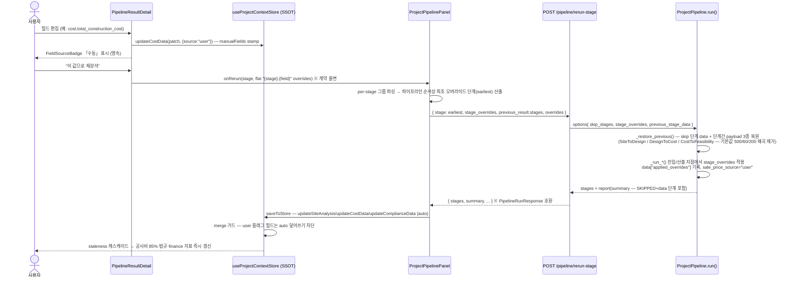

# PropAI 업그레이드 블루프린트 (2026-06-11)

> 3개 설계 축(축1: 다이나믹 워크플로우 / 축2: CAD·BIM 고도화 / 축3: 전주기 스토리라인·적산정합·AI신뢰성)을 종합·중복 제거·의존성 정리한 실행 청사진.
> 저장소: `\\wsl$\Ubuntu\home\kangjh3kang\My_Projects\Development_AI\propai-platform`

**공통 원칙 (3축 합의)**
1. **신규 엔진 0** — 기존 부품의 배선 복원·연결만 수행한다.
2. **전 변경 additive·하위호환** — 옵셔널 필드/파라미터, append-only, 기존 호출 무수정 동작.
3. **정직성(No Fake)** — 가짜 폴백·하드코딩 값은 "데이터 없음/가정값" 명시로 전환, 출처(provenance)를 항상 표기.
4. **삭제는 고아(마운트 0건) 확인 후** — grep으로 잔존 import 0건 검증 → tsc/빌드로 재확인.

---

## ① 목표 스토리라인 — 전주기 여정 (끊긴 관절 4개가 연결된 모습)

```
발굴(경매·G2B) ─[관절1]→ 사전검토 → 프로젝트 생성 → 부지분석 ⇄[관절2]⇄ 사용자 수정·재분석
      → 설계(CAD/BIM 생성·편집) ─[관절3]→ 적산(BOQ·BIM물량) → 수지(V2·몬테카를로)
      → 보고서 ─[관절4]→ 운영(임차인·유지보수·디지털트윈)
```

### 관절 1 — 입구: 발굴 → 기획 (현재 단절)
경매 워크스페이스·G2B 입찰 대시보드에서 분석을 마쳐도 프로젝트로 이어지는 동선이 없다.
**연결 후 모습**: 경매 물건/G2B 공고 상세에서 **"이 물건으로 프로젝트 생성"** CTA → 기존 precheck 핸드오프(sessionStorage)를 그대로 재사용해 `projects/new`가 주소·면적·메모를 선채움. `PreCheckHandoff`에 옵셔널 `source`("precheck"|"auction"|"g2b")·`memo`만 추가하므로 기존 consume 검증식 불변. (WP-05)

### 관절 2 — 루프: 분석 ⇄ 사용자 수정 (현재 일방향·휘발)
파이프라인 결과를 사용자가 수정해도 ①재분석에 반영되지 않고(기본값 500/60/200으로 왜곡 재계산) ②페이지 이탈 시 수정값이 소실되며 ③자동 갱신이 사용자 입력을 덮어쓴다.
**연결 후 모습**: 필드 단위 provenance(`manualFields` 맵)로 수동/자동 출처를 영속 관리 — 수동 필드는 자동 갱신이 덮어쓰지 못하고(merge 가드), `/pipeline/rerun-stage`가 다단계 오버라이드(`stage_overrides`) + 이전 결과 payload(`previous_stage_data`)를 받아 **수정 지점부터 정확히 재계산**한다. 결과는 `applied_overrides`·`sale_price_source="user"`로 출처를 정직 표기하고, saveToStore 환류로 cost/compliance/design이 SSOT에 연결돼 staleness 캐스케이드가 즉시 작동한다. (WP-01·02·03·14·22·24)

### 관절 3 — 설계·적산 → 수지 (현재 단절)
CAD 편집이 DXF/GLB·수지에 반영되지 않고, BOQ 적산 결과가 수지분석과 따로 논다.
**연결 후 모습**:
- **편집 사슬**: CADEditor 폴리곤 편집 → 저장 시 bbox 역산 치수(`building_width/depth_m`) 동봉 → GLB 12×9m 폴백 해소, `create_dxf_from_edited_points`로 편집본 DXF(정식 DIMENSION 포함) 다운로드. (WP-04·16·25)
- **라이브 수지 루프**(TestFit 차별화): 정점 드래그 즉시 LiveProFormaStrip이 기존 `unit-mix/simulate`(+`footprint_sqm`)로 분양수익·공사비·마진·ROI를 갱신 — 읽기 전용이라 SSOT staleness 체인 비침범. (WP-16·25)
- **적산 정합**: BOQ 합계 → `updateCostData(source:"boq")` 1방향 주입 → 기존 `construction_cost_override_won` 라인이 살아있어 **백엔드 무변경**으로 수지 정밀화. IFC 파싱→공종 매핑→`bim_quantities` INSERT→12단계 원가계산 배선. v2 몬테카를로는 실수지 함수로 교체. (WP-08·09·10·18)

### 관절 4 — 출구: 보고서 → 운영 (현재 막다른 길)
보고서 단계가 여정의 끝이고, 이미 존재하는 운영 라우트(operations/tenant/maintenance/digital-twin)는 도달 불가.
**연결 후 모습**: `LIFECYCLE_STAGES` 끝에 `"operations"` append-only 추가 → NextStageCta가 SSOT 순서 기반이라 "보고서→운영" CTA 자동 활성. 자산운영 메뉴 3종(임차인 포털·시설 유지보수·디지털 트윈) + 프로젝트 개요 "확장 모듈" 카드 그리드(도달불가 서브라우트 9종)로 운영 국면 진입. (WP-06·07·17)

**횡단 신뢰 축(AI 정직성)**: 스텁 오케스트레이터 삭제·simulate-feasibility 실계산 전환, LLM 모델 단일출처(get_llm), AI 비서 SSOT 컨텍스트+SSE 스트리밍, 사이트 폴백 가정값 명시, mock 게이트 판정식 SSOT 통일 — 여정 전 구간의 수치를 "근거 있는 값"으로 만든다. (WP-11·12·13·19, WP-01·22·24의 E7 병합분)

---

## ② 다이나믹 워크플로우 아키텍처

### 2-1. Provenance 모델 — 병행 `manualFields` 맵

`siteAnalysis.landAreaSqm` 등 평탄 필드를 수십 소비처가 직접 읽으므로 `{value, source}` 래핑은 전 소비자 파괴 → **store 톱레벨 병행 맵**을 채택한다.

```ts
// apps/web/store/useProjectContextStore.ts
export type FieldSource = "auto" | "user";
export interface FieldProvenance { source: FieldSource; updatedAt: number; }
export type ProvenanceModule = "siteAnalysis" | "cost";

// State 추가 (초기 {})
manualFields: Partial<Record<ProvenanceModule, Record<string, FieldProvenance>>>;

// 액션 — 옵셔널 2번째 인자 = 기존 호출 무수정 호환
updateSiteAnalysis(data: Partial<SiteAnalysisData>, meta?: { source?: FieldSource }); // 기본 "auto"
updateCostData(data: CostData, meta?: { source?: FieldSource });
revertFieldToAuto(module: ProvenanceModule, field: string): void;   // 다음 자동갱신 허용
getFieldProvenance(module: ProvenanceModule, field: string): FieldProvenance | null;
```

**merge 가드 규칙**
| 갱신 방향 | siteAnalysis (partial patch) | costData (full replace) |
|---|---|---|
| auto → user 플래그 필드 | user 키를 patch에서 **제거**(빈 patch면 stamp 생략) | user 키의 **이전값 보존** 후 replace |
| user 갱신 | 각 키를 `{source:"user", updatedAt:Date.now()}` stamp | 동일 stamp |
| revertFieldToAuto | manualFields에서 삭제 → 자동갱신 재허용 | 동일 |

- 스냅샷: `ProjectSnapshot`에 `manualFields` 포함, 구 스냅샷은 기존 `analysisCache ?? {}` 폴백 패턴과 동일하게 `?? {}` 복원 — round-trip 보존.
- 배지: 공용 `FieldSourceBadge`(파랑 「수동」 = 금융모델링 색상 관행 / 회색 「자동」) — `PipelineResultDetail` 편집셀에 노출, 오버라이드를 store에 user로 영속(이탈 시 소실 해소).
- 가정값 가드(E7): 사이트 폴백이 기본값(제2종/500㎡)을 주입하면 `assumed_fields`+`data_quality:"assumed_defaults"` 기록 → saveToStore는 해당 필드를 SSOT 시드에서 **제외**(가정값 오염 방지), UI는 경고 배지 표시.

### 2-2. 재분석 시퀀스 다이어그램



**3점 배선 복원 요약**
1. **서비스**(`project_pipeline.py`): `previous_stage_data` 복원 + `_apply_site_overrides`/단계별 오버라이드 소비 + `_run_report`가 SKIPPED+data 단계를 summary에 포함. 기존 rerun-stage 라우터의 options 주입이 즉시 실효(A1).
2. **라우터**(`pipeline.py`): `StageRerunRequest.stage_overrides`(다단계, 기존 단일 `overrides`와 병합), `previous_result.stages → options`, 응답에 `summary` 추가.
3. **프론트**(`ProjectPipelinePanel.handleRerun`): `/pipeline/rerun-stage` 전환. 오버라이드 적용 시 기존 데드 라벨 `SALE_SOURCE_LABEL.user` 자동 활성화. E1: interpret body `use_verification_retry: true` 1행으로 기 구현 검증관·재생성 루프 활성화.

---

## ③ CAD/BIM 고도화 설계

### 3-1. 구세대 Konva 스택 결단 = "핵심 이식 + 삭제" (마운트안 기각)
실코드 근거: ①스택 전체 마운트 0건 고아, 자유도형 편집이 spec→design_versions→DXF/GLB 사슬과 미연결이라 마운트 시 갭#3을 오히려 확대 ②패널 6종 중 3종이 가짜 AI(E6)·가짜 3D(F3)·하드코딩 내보내기(F4) 제거 대상 ③감사 C5가 "이식" 방향 기명시, 편집기·스토어 2벌 부채 해소 ④이식 비용 소형 — `use-cad-store`의 스냅샷 undo(MAX 50) 패턴만 `design/CADEditor`에 ~60행 훅으로 이식. 레이어 기능은 단일 폴리곤 편집기에 무의미 → 미이식(정직한 스코프). `GenerativeDesignPanel`·`types.ts`만 존치, 죽은 `loadDesignPayload` 경로 제거.

### 3-2. 편집 사슬 (편집 → DXF/GLB)
- `ParametricCADService.create_dxf_from_edited_points(points, surfaces, scale_px_per_m=10)`: 링 복원 → px→m 변환·Y축 반전 → WALL 레이어 LWPOLYLINE + ezdxf `add_linear_dim` **정식 DIMENSION**(C4: 기존 `_add_dimension_h/_v` 내부 교체, 시그니처 유지로 5종 도면 하위호환).
- 신규 `GET /design/{pid}/drawings/export-edited-dxf`(인증+소유권 검사, 저장본 없으면 404 정직).
- C2: CADEditor 저장 페이로드에 ring bbox 역산 `building_width/depth_m` + `floor_height_m` — `_load_mass_from_design_version`이 이미 소비하므로 GLB 폴백 즉시 해소.
- C3: `DrawingSetRequest.drawing_type`(기본 `floor_plan` — 하위호환)으로 평면/상세/단면/입면/배치 5종 분기.

### 3-3. 라이브 수지 루프 (TestFit 차별화)
신규 `LiveProFormaStrip`이 기존 `/design/{pid}/unit-mix/simulate`(자체완결·고속)를 400ms 디바운스로 재사용, `footprint_sqm` 파라미터 추가로 임의 폴리곤 정확 반영. **읽기 전용**(SSOT 쓰기 금지) — 정밀 수지는 기존 `updateDesignData → cost/feasibility stale` 경로 그대로. 스튜디오 상시 + 편집모드 정점 드래그 즉시 갱신, `price_source` 출처 라벨 정직 표기.

### 3-4. 인증(F1) + 테스트 교정
save/load/export-edited-dxf에 `get_current_user` + tenant_id 소유권 검사(v2_feasibility 패턴). 실측 실패 2건 교정: `test_save_drawing` → echo 계약 단언+무인증 401 테스트 추가, `test_select_alternative` → `mc_results` 스키마를 dict로 교정(유일 소비자였던 DesignAlternativesPanel은 고아·삭제).

### 3-5. 쉬운 모드 동선 (Hypar 교훈: 구조화 입력 + 대화 편집 + 항상 편집 가능한 산출물)
생성(슬라이더+자연어+음성, 기존) → 적용 직후 **"③ 도면 다듬기" CTA**로 편집모드 직행 → 3단계 스테퍼(①AI로 생성 → ②도면·3D 확인 → ③직접 다듬고 내보내기) → undo/redo(Ctrl+Z)+최초 1회 도움말 칩+라이브 수지 → DXF 종류 셀렉트 내보내기.

### 3-6. 삭제 목록 (전부 마운트 0건 고아 — grep 실측, 삭제 전 잔존 import 0건 재검증)
`components/cad/{CadEditor, CadCanvasInner, CadToolbar, CadCommandLine, LayerPanel, CadCompliancePanel, CadBimSidePanel, AutoDesignPanel, DesignAlternativesPanel, ExportPanel, DrawingAnalysisPanel(E6), ThreeScene(F3)+테스트, CadExportPanel(F4)}.tsx`, `components/bim/BIMViewer3D.tsx`, `components/compliance/ComplianceHud.tsx`, `store/use-cad-store.ts`+멀티셀렉트 테스트, `lib/dxf-exporter.ts`, `lib/parametric-design-engine.ts`(importer 0건 확인 후), `lib/stores/index.ts`의 re-export 제거. **보존**: `GenerativeDesignPanel.tsx`(마운트됨 — useCadStore 의존 선제 제거), `components/cad/types.ts`(타 컴포넌트 import 중).

---

## ④ 페이지 구성 변경 총괄표

| # | 화면/모듈 | 변경 내용 | 유형 | 관련 WP |
|---|---|---|---|---|
| 1 | 경매 워크스페이스 (`AuctionWorkspace`) | "이 물건으로 프로젝트 생성" CTA (주소 없으면 비노출) | 수정 | WP-05 |
| 2 | G2B 입찰 대시보드 (`G2BBidDashboard`) | 동일 CTA (region_sido 기반, memo=공고명) | 수정 | WP-05 |
| 3 | 대시보드 레이아웃 (`layout.tsx`) | 자산운영 메뉴 3종 추가: 임차인 포털·시설 유지보수·디지털 트윈 | 수정 | WP-06 |
| 4 | 승인운영 (`ApprovalOperationsWorkspaceClient`) | `/agent` 죽은 링크(404) → `/projects`로 수정 | 수정 | WP-06 |
| 5 | 프로젝트 개요 (`projects/[id]/page.tsx`) | 신규 `ExtensionModulesGrid` — 도달불가 서브라우트 9종 링크 카드 | 신규+수정 | WP-07 |
| 6 | 라이프사이클 레일 (SSOT 전 화면) | `operations` 단계 append → "보고서→운영" CTA 자동 활성 | 수정 | WP-17 |
| 7 | 파이프라인 결과 상세 (`PipelineResultDetail`) | `FieldSourceBadge`(수동/자동), 오버라이드 store 영속·복원, 가정값 경고 배지, 검증관 재시도(E1) | 수정 | WP-03·22 |
| 8 | 파이프라인 패널 (`ProjectPipelinePanel`) | handleRerun → `/pipeline/rerun-stage`, saveToStore 환류(cost·compliance·design), 가정값 SSOT 시드 제외 | 수정 | WP-24 |
| 9 | 설계 스튜디오 (`CadBimIntegrationPanel`) | `LiveProFormaStrip` 마운트, 3단계 스테퍼, "도면 다듬기" CTA, DXF 종류 셀렉트, designApiBase 하드코딩 제거 | 수정 | WP-19·25 |
| 10 | CAD 편집기 (`CADEditor`) | undo/redo(Ctrl+Z), 매스치수 저장, apiClient 인증 전환, 편집본 DXF 버튼, 도움말 칩, onMetricsChange | 수정 | WP-25 |
| 11 | 생성설계 패널 (`GenerativeDesignPanel`) | 죽은 `useCadStore/loadDesignPayload` 경로 제거 (동작 불변) | 수정 | WP-21 |
| 12 | 적산 상세 (`BoqDetailTable`) | "이 적산 결과를 수지분석에 반영" 버튼 (`source:"boq"`) | 수정 | WP-08 |
| 13 | AI 비서 (`AIAssistant`) | SSOT 요약 컨텍스트 동봉 + SSE 스트리밍(점증 렌더, 실패 시 단발 폴백) | 수정 | WP-13 |
| 14 | 신규 공용 컴포넌트 | `FieldSourceBadge`(common/), `LiveProFormaStrip`(design/), `ExtensionModulesGrid`(projects/), `lib/runtime-mode.ts` | 신규 | WP-03·07·19·25 |
| 15 | tenant·maintenance 등 ~20개 페이지 | mock 게이트 판정식 `runtimeMode()` SSOT 통일 (`==="false"` 모순 해소) | 수정 | WP-19 |
| 16 | 구세대 CAD 스택 (cad/ 6패널 외) | 가짜 AI·가짜 3D·하드코딩 내보내기 포함 일괄 삭제 (§3-6 목록) | 삭제 | WP-26 |

---

## ⑤ 워크패키지 목록

### 충돌 해소 결정 (병합·순서화 내역)

| 충돌 파일 | 원천 패키지 | 해소 |
|---|---|---|
| `project_pipeline.py` | 축1-W1 + 축3-E7(백엔드) | **병합 → WP-01** (오버라이드 소비 + 가정값 정직화를 한 패키지로) |
| `ProjectPipelinePanel.tsx` | 축1-W7 + 축3-E7(시드 가드) | **병합 → WP-24** |
| `PipelineResultDetail.tsx` | 축1-W8 + 축3-E7(경고 배지) | **병합 → WP-22** (E7은 3분할 병합으로 소멸) |
| `useProjectContextStore.ts` | 축1-W4 + 축3-B2 + 축3-D1(주석) | D1 주석은 **WP-02에 병합**, B2(WP-17)는 **웨이브 2로 순서화** |
| `design_v61.py`+테스트 | 축2-W2 + 축2-W3 | **병합 → WP-16** (동일 파일·순차 의존) |
| `CADEditor.tsx`·`CadBimIntegrationPanel.tsx` | 축2-W4+W5+W6 | **병합 → WP-25**, 단 GenerativeDesignPanel 죽은 경로 제거는 **WP-21로 분리**(웨이브 2 — WP-26 삭제의 선행조건) |
| `app/routers/cost.py` | 축3-D3 + 축3-D2 | D3(WP-09) 웨이브 1 → D2(WP-18) **웨이브 2로 순서화** |
| `layout.tsx` | 축3-B3B5 + 축3-F5 | WP-06 웨이브 1 → WP-19 **웨이브 2로 순서화** |
| `parametric_cad_service.py` | 축2-W1 + 축3-F6(docstring) | WP-04 웨이브 1 → WP-20 **웨이브 2로 순서화** |
| `CadBimIntegrationPanel.tsx` | 축3-F5 + 축2-W5/W6 | WP-19(웨이브 2)가 apiV1BaseUrl 정리 선행 → WP-25(웨이브 3)가 그 위에 기능 추가 |

> 검증: 동일 웨이브 내 두 패키지가 같은 파일을 수정하는 경우 0건. 모든 `depends_on`은 이전 웨이브에만 존재(WP-27 검증 패키지는 웨이브 3 말미 실행, 소스 무수정).

### 웨이브 1 — 기반 배선 (병렬 13개)

| ID | 원천 | 파일 | 스펙 요약 | 의존성 | 리스크 |
|---|---|---|---|---|---|
| **WP-01** | 축1-W1 + E7(BE) | `apps/api/app/services/pipeline/project_pipeline.py` | `_restore_previous()`로 skip 단계 data+payload 3종(SiteToDesign/DesignToCost/CostToFeasibility) 복원, `_run_*` 전 단계에 `stage_overrides` 소비(`applied_overrides` 기록, cost_per_pyeong 재계산·`sale_price_source="user"` 등), `_run_report`를 SKIPPED+data 포함으로 확장. **+E7**: `_fetch_real_site_data` 기본값 주입 시 `assumed_fields`·`data_quality:"assumed_defaults"`·warnings 기록(수치는 유지 — 중단 없음) | — | 중 |
| **WP-02** | 축1-W4 + D1(주석) | `apps/web/store/useProjectContextStore.ts` | `FieldSource/FieldProvenance/ProvenanceModule` 타입 + `manualFields` state + 액션 옵셔널 `meta` 인자(§2-1 merge 가드) + `revertFieldToAuto`/`getFieldProvenance` + 스냅샷 round-trip. CostData.source 주석 "overview\|bim\|boq" 갱신. 기존 호출 전부 무수정 동작 | — | 중 |
| **WP-03** | 축1-W6 | `apps/web/components/common/FieldSourceBadge.tsx` (신규) | 순수 presentational 칩 — user=파랑 「수동」/auto=회색 「자동」, 기존 칩 스타일 컨벤션·CSS 변수·title 안내문 | — | 하 |
| **WP-04** | 축2-W1 | `apps/api/app/services/cad/parametric_cad_service.py`, `apps/api/tests/test_parametric_cad_service.py` | `_add_dimension_h/_v` 내부를 ezdxf `add_linear_dim` 정식 치수로 교체(시그니처 불변), 신규 `create_dxf_from_edited_points()`(링 복원·px→m·LWPOLYLINE·각 변 치수·ezdxf 미설치 폴백), ezdxf 재파싱 테스트 | — | 하 |
| **WP-05** | 축3-B1 | `apps/web/components/precheck/handoff.ts`, `auction/AuctionWorkspace.tsx`, `g2b/G2BBidDashboard.tsx` | `PreCheckHandoff`에 옵셔널 `source`/`memo`(consume 검증식 불변), 경매 물건 상세·G2B 공고에 "프로젝트 생성" CTA — `writePreCheckHandoff` 후 `projects/new` 이동(기존 startProject 패턴). 주소 없으면 비노출 | — | 하 |
| **WP-06** | 축3-B3B5 | `apps/web/app/[locale]/(dashboard)/layout.tsx`, `agent/ApprovalOperationsWorkspaceClient.tsx` | `assetOpsNavigation`에 tenant/maintenance/digital-twin 3항목(기존 lease 패턴, 라우트 기존재), `/agent` 404 링크 → `/projects` 1행 교체 | — | 하 |
| **WP-07** | 축3-B4 | `apps/web/components/projects/ExtensionModulesGrid.tsx` (신규), `projects/[id]/page.tsx` | 도달불가 서브라우트 9종(agent/cad/cost/contracts/drone/supervision/operations/blockchain/multi-parcel) 링크 카드 그리드 — 디자인 토큰 준수, 데이터 fetch 없음(회귀면 0). NextStageCta 아래 dynamic 마운트 | — | 하 |
| **WP-08** | 축3-D1 | `apps/web/components/cost/BoqDetailTable.tsx` | summary 카드에 "수지분석에 반영" 버튼 → `updateCostData({total/direct/indirect/per㎡/per평, source:"boq"})` — 기존 `construction_cost_override_won` 라인이 살아있어 백엔드 무변경, staleness 자동 트리거. (store 주석은 WP-02에 병합) | — | 하 |
| **WP-09** | 축3-D3 | `apps/api/app/services/cost/standard_quantity_estimator.py`, `app/routers/cost.py`, `services/cost/boq_builder.py` | `estimate(prices=None)` 옵셔널 주입(미주입 시 기존 동기 resolve — 하위호환), estimate-overview에서 `UnitPriceRepository.get_prices()` 1회 조회 주입(DB 실패 시 None 폴백), price_source "db"/"fallback" 정직 표기 확인 | — | 하 |
| **WP-10** | 축3-D4 | `apps/api/app/routers/v2_feasibility.py`, `app/schemas/feasibility_v2.py`, `tests/test_v2_monte_carlo.py` | `MonteCarloRequest.base` 옵셔널 추가 — base 제공 시 실수지 `FeasibilityServiceV2.calculate` 섭동 함수로 교체(미제공 시 simple_npv 유지), 죽은 import 활성화로 `POST /sensitivity` 신설(토네이도), 회귀 테스트 | — | 중 |
| **WP-11** | 축3-E3 | `apps/api/app/routers/project_dashboard.py` + 스텁 3본·테스트 2본 삭제, `tests/integration/test_full_pipeline.py` | simulate-feasibility를 실계산(estimate_overview + 실 `MonteCarloService`)으로 교체 — 개요 미확정 시 가짜 1.28B 대신 `no_data` 정직 응답(프론트 응답 계약 유지). 스텁 `orchestrator.py`('인허가 자동 신청 완료' 허위)·미마운트 `agents.py`·`langgraph_orchestrator.py` 삭제. 정본 `propai_orchestrator.py` 유지 | — | 중 |
| **WP-12** | 축3-E2E5 | `apps/api/agents/propai_orchestrator.py`, `app/services/market/conversational_market_ai.py`, `tests/test_conversational_market_ai.py` | `_step_report` 하드코딩 모델 → `get_llm()` 단일출처, ConversationalMarketAI에 LLM 분석 우선(+MOLIT data 근거 한정 프롬프트)·키 부재 시 템플릿 폴백·`analysis_source` 필드, 폴백 단위테스트 | — | 하 |
| **WP-13** | 축3-E4 | `apps/api/routers/ai_assistant.py`, `apps/web/components/common/AIAssistant.tsx`, `apps/web/lib/realtime.ts` | `/chat`에 옵셔널 `context`(SSOT 요약, 2KB 절단) + `/chat/stream` SSE 신설(기존 /chat 보존), `realtime.ts`에 fetch 기반 `readSseStream`(EventSource POST 불가 보완), AIAssistant 점증 렌더+실패 시 단발 폴백 | — | 중 |

### 웨이브 2 — 연결 계층 (병렬 9개)

| ID | 원천 | 파일 | 스펙 요약 | 의존성 | 리스크 |
|---|---|---|---|---|---|
| **WP-14** | 축1-W2 | `apps/api/app/routers/pipeline.py` | `StageRerunRequest.stage_overrides`(다단계, 기존 단일 overrides와 병합·호환), `previous_result.stages → options["previous_stage_data"]`, 응답에 `summary` 추가(PipelineRunResponse 호환). 기존 키 불변 | WP-01 | 하 |
| **WP-15** | 축1-W5 | `apps/web/lib/useProjectContextStore.provenance.test.ts` (신규) | vitest 6케이스: user 보존/auto 부분반영, costData full-replace 보존, revert 후 재덮어쓰기, getFieldProvenance, 스냅샷 round-trip, meta 미전달 하위호환 고정 | WP-02 | 하 |
| **WP-16** | 축2-W2+W3 병합 | `apps/api/app/routers/design_v61.py`, `tests/test_design_v61_router.py` | save/load에 인증+tenant 소유권(403), `CADSaveRequest`에 매스치수 3필드(C2), 신규 `GET /drawings/export-edited-dxf`(404 정직), `mc_results` dict 교정, `DrawingSetRequest.drawing_type` 5종 분기(C3), `UnitMixSimulateRequest.footprint_sqm`(gt=0), 테스트: 401·404·echo 계약·section DXF·footprint 반영 | WP-04 | 중 |
| **WP-17** | 축3-B2 | `apps/web/store/useProjectContextStore.ts`, `lib/lifecycle-stages.ts`, `components/common/StageIcon.tsx`, `lib/useProjectContextStore.cascade.test.ts` | `LIFECYCLE_STAGES` 끝 `"operations"` append(영속 스냅샷 호환), `STAGE_META/STAGE_GROUPS`에 운영 그룹+supervision/drone extraRoutes(라우트 기존재 — 404 없음), 단계수 가정 테스트 10→11 갱신. NextStageCta 무수정 자동 활성 | WP-02 (파일 순서화) | 하 |
| **WP-18** | 축3-D2 | `apps/api/services/bim_ifc_service.py`, `app/routers/cost.py`, `routers/bim.py`, `tests/test_bim_quantities_wiring.py` | `_parse_ifc`에 요소 단위 elements 반환(기존 키 유지), analyze_ifc에서 `map_ifc_to_work_codes` → `BimQuantity` bulk INSERT(동일 세션), 신규 `GET /bim-quantities/origin-cost`(단가 결합 → `OriginCostCalculator` 12단계, 0건 시 `no_bim_quantities` 정직), 단위테스트 | WP-09 (cost.py 순서화) | 중 |
| **WP-19** | 축3-F5 | `apps/web/lib/runtime-mode.ts` (신규), `lib/api-client.ts`, `design/CadBimIntegrationPanel.tsx`, `(dashboard)/layout.tsx`, `tenant/page.tsx`, `maintenance/page.tsx` 외 직독 ~20개 | mock 판정식 SSOT `NEXT_PUBLIC_USE_MOCKS === "true"` 통일(`==="false"` 모순 해소), `apiV1BaseUrl` 공개, `designApiBase()`+4t8t.net 하드코딩 삭제 → 호출 7곳 교체 | WP-06 (layout.tsx 순서화) | 하 |
| **WP-20** | 축3-F6 | `apps/api/app/routers/drawing.py`(삭제), `tests/test_export_endpoints.py`, `app/services/feasibility/version_control.py`+테스트(삭제), `services/cad_auto_correction_service.py`, `app/services/cad/parametric_cad_service.py` | 미마운트 중복 라우터: 경로 인벤토리 diff 후 필요분 정본 포팅→삭제, 테스트 정본 repoint(DXF 커버리지 유지). in-memory VCS(importer 0건)+테스트 삭제. BuildingModel 2벌은 **병합 금지**(서로 다른 라이브 경로) — `ComplianceBuildingModel` 리네임+기존명 alias·docstring 정본 명시 | WP-04 (parametric 순서화) | 중 |
| **WP-21** | 축2-W6 분할 | `apps/web/components/cad/GenerativeDesignPanel.tsx` | `useCadStore` import·`loadDesignPayload` 셀렉터·호출 제거 — 미마운트 캔버스로 가는 죽은 데이터 경로 청산. applyDesign 시그니처·updateDesignData/markStageComplete/onApplied 불변. **WP-26(use-cad-store 삭제)의 선행조건** | — | 하 |
| **WP-22** | 축1-W8 + E7(배지) | `apps/web/components/pipeline/PipelineResultDetail.tsx` | E1: interpret body `use_verification_retry:true` 1행. `STORE_FIELD_MAP`으로 오버라이드를 store에 user 영속(land_area_sqm·total_construction_cost), 마운트 시 manualFields → overrides 시드 복원, FieldSourceBadge 노출(영속 user)+기존 '수정됨' 칩(세션), 초기화 시 `revertFieldToAuto`. flat "{stage}.{field}" onRerun 계약 불변. **+E7**: 사이트 카드에 `data_quality` 가정값 경고 배지(var(--status-warning)) | WP-02, WP-03 | 중 |

### 웨이브 3 — 완성·정리·검증 (5개)

| ID | 원천 | 파일 | 스펙 요약 | 의존성 | 리스크 |
|---|---|---|---|---|---|
| **WP-23** | 축1-W3 | `apps/api/tests/test_project_pipeline_rerun.py` (신규) | pytest 6항목: payload 복원(기본값 500/60/200 미사용), stage_overrides 반영+applied_overrides, cost 재계산·user_override, feasibility sale_price_source="user"·profit 재산출, report의 SKIPPED+data 포함, 옵션 미전달 하위호환 고정 + 라우터 조립·summary 검증 | WP-01, WP-14 | 하 |
| **WP-24** | 축1-W7 + E7(가드) | `apps/web/components/pipeline/ProjectPipelinePanel.tsx` | handleRerun을 `/pipeline/rerun-stage` 전환(flat→per-stage 파싱, STAGE_ORDER 최초 단계 산출, previous_result.stages 동봉, 응답 stages+summary 처리). saveToStore 환류: design(unitCount/unitTypes/efficiencyPct)+cost(updateCostData)+compliance(BL-001/002/003 → updateComplianceData+markStageComplete("legal")). **+E7**: `data_quality==="assumed_defaults"`면 assumed_fields를 SSOT 시드에서 제외 | WP-14, WP-02 | 중 |
| **WP-25** | 축2-W4+W5+W6 병합 | `apps/web/components/design/CADEditor.tsx`, `design/LiveProFormaStrip.tsx` (신규), `design/CadBimIntegrationPanel.tsx` | CADEditor: undo/redo 스냅샷 스택(MAX 50, Ctrl+Z/Shift+Z, ↶↷ 버튼), 매스치수 bbox 역산 저장(C2), apiClient 인증 전환, 편집본 DXF 버튼(404 시 안내), `onMetricsChange` prop, 최초 1회 도움말 칩. LiveProFormaStrip: 400ms 디바운스 unit-mix/simulate(footprint_sqm)·읽기 전용·price_source 라벨. CadBimIntegrationPanel: 스트립 마운트(스튜디오 상시+편집 드래그 연동), "도면 다듬기" CTA+3단계 스테퍼, exportDxf 도면종류 셀렉트(drawing_type) | WP-16, WP-19, WP-21 | 중 |
| **WP-26** | 축2-W7 | §3-6 삭제 목록 (cad/ 패널들, BIMViewer3D, ComplianceHud, use-cad-store+테스트, dxf-exporter, parametric-design-engine, lib/stores/index.ts) | 구세대 CAD 스택+가짜 AI(E6)·가짜 3D(F3)·하드코딩 내보내기(F4) 일괄 청산. 각 파일 삭제 전 grep 잔존 import 0건 검증 → tsc/빌드 확인. GenerativeDesignPanel·types.ts 보존. WP-25와 파일 비중첩(병렬 가능) | WP-21 | 중 |
| **WP-27** | 축2-W8 확장 | (소스 무수정 — 검증 전용, **웨이브 3 말미** 전 패키지 완료 후) | ①백엔드: pytest 전건(design_v61·parametric·rerun·bim_wiring·v2_mc·market_ai) ②프론트: 빌드+vitest/jest — 삭제 파일 잔존 import 0건 ③수동 사슬: 생성→다듬기 CTA→드래그 시 수지 갱신→Ctrl+Z→저장(401 유도 확인)→3D 편집치수 반영(12×9 폴백 아님)→편집본 DXF에 LWPOLYLINE+DIMENSION ④하위호환 스모크: drawing_type 미전달 export-dxf 200, footprint_sqm 미전달 simulate 200, meta 미전달 store 액션, base 미전달 monte-carlo, 기존 /ai/chat | 웨이브 1·2·3 전체 | 하 |

### 웨이브 배치 요약

| 웨이브 | 패키지 수 | 성격 | 게이트 |
|---|---|---|---|
| **1** | 13 (WP-01~13) | 상호 독립 기반 배선 — 파이프라인 서비스·store provenance·CAD 서비스·입구 CTA·메뉴·적산/AI 정직화 | 각 패키지 단위테스트 + 기존 스위트 무회귀 |
| **2** | 9 (WP-14~22) | 웨이브 1 위 연결 계층 — 라우터·design_v61·운영 단계·BIM 배선·mock 통일·중복 정리·결과 상세 | provenance vitest + design_v61 pytest 통과 |
| **3** | 5 (WP-23~27) | 완성·정리 — rerun 테스트·패널 환류·CAD 프론트 통합·구스택 삭제·통합 검증 | WP-27 전 항목 통과 = 출하 게이트 |

**총 27개 워크패키지** (원천 29건 → E7 3분할 병합, D1 주석 병합, 축2 W2+W3 병합, 축2 W4+W5+W6 병합·W6 일부 분리). 동일 웨이브 내 파일 충돌 0건, 모든 의존성은 이전 웨이브에 위치.
